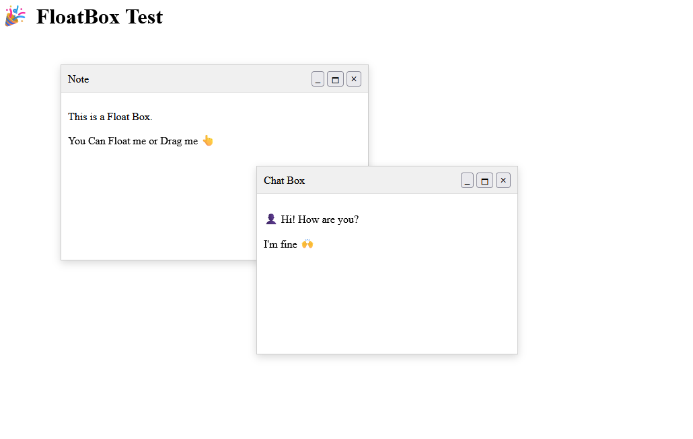

# React Float Box

A lightweight, customizable floating window component for React applications. Create draggable, resizable floating boxes with a native window-like experience.



## ✨ Features

- 🖱️ **Draggable**: Click and drag the title bar to move the window
- 📏 **Resizable**: Resize from any edge or corner with intuitive handles
- 🎯 **Minimize/Maximize**: Built-in minimize and maximize functionality
- 📱 **Responsive**: Automatically adjusts to viewport boundaries
- 🎨 **Customizable**: Flexible styling and positioning options
- ♿ **Accessible**: Proper focus management and keyboard support
- 📦 **Lightweight**: Zero dependencies, pure React implementation

## 📦 Installation

```bash
npm install @mohsensami/float-box
```

```bash
yarn add @mohsensami/float-box
```

```bash
pnpm add @mohsensami/float-box
```

## 🚀 Quick Start

```tsx
import { FloatBox } from "@mohsensami/float-box";

function App() {
  return (
    <div>
      <FloatBox
        title="My Floating Window"
        initialPosition={{ x: 100, y: 100 }}
        initialSize={{ width: 400, height: 300 }}
      >
        <p>This is a floating window!</p>
        <p>You can drag me around and resize me.</p>
      </FloatBox>
    </div>
  );
}
```

## 📖 API Reference

### FloatBox Props

| Prop              | Type                                | Default                       | Description                                    |
| ----------------- | ----------------------------------- | ----------------------------- | ---------------------------------------------- |
| `title`           | `string`                            | `"Floating Window"`           | The title displayed in the window header       |
| `children`        | `React.ReactNode`                   | -                             | Content to display inside the floating window  |
| `initialPosition` | `{ x: number; y: number }`          | `{ x: 120, y: 120 }`          | Initial position of the window                 |
| `initialSize`     | `{ width: number; height: number }` | `{ width: 420, height: 300 }` | Initial size of the window                     |
| `minSize`         | `{ width: number; height: number }` | `{ width: 320, height: 160 }` | Minimum size the window can be resized to      |
| `onClose`         | `() => void`                        | -                             | Callback function when close button is clicked |
| `zIndex`          | `number`                            | `100`                         | CSS z-index value for the window               |
| `onFocus`         | `() => void`                        | -                             | Callback function when window gains focus      |
| `className`       | `string`                            | -                             | Additional CSS class name                      |
| `id`              | `string`                            | -                             | HTML id attribute                              |

## 🎯 Examples

### Basic Usage

```tsx
import { FloatBox } from "@mohsensami/float-box";

function BasicExample() {
  return (
    <FloatBox title="Simple Window">
      <p>Hello, World!</p>
    </FloatBox>
  );
}
```

### Custom Position and Size

```tsx
import { FloatBox } from "@mohsensami/float-box";

function CustomWindow() {
  return (
    <FloatBox
      title="Custom Window"
      initialPosition={{ x: 200, y: 150 }}
      initialSize={{ width: 500, height: 400 }}
      minSize={{ width: 300, height: 200 }}
    >
      <div>
        <h3>Custom positioned window</h3>
        <p>This window starts at position (200, 150) with size 500x400</p>
      </div>
    </FloatBox>
  );
}
```

### With Event Handlers

```tsx
import { FloatBox } from "@mohsensami/float-box";

function InteractiveWindow() {
  const handleClose = () => {
    alert("Window closed!");
  };

  const handleFocus = () => {
    console.log("Window focused!");
  };

  return (
    <FloatBox
      title="Interactive Window"
      onClose={handleClose}
      onFocus={handleFocus}
      zIndex={1000}
    >
      <p>This window has custom event handlers.</p>
      <button onClick={() => alert("Button clicked!")}>Click me!</button>
    </FloatBox>
  );
}
```

### Multiple Windows

```tsx
import { FloatBox } from "@mohsensami/float-box";

function MultipleWindows() {
  return (
    <div>
      <FloatBox
        title="Note"
        initialPosition={{ x: 100, y: 120 }}
        initialSize={{ width: 400, height: 300 }}
      >
        <p>This is a note window.</p>
        <p>You can have multiple floating windows!</p>
      </FloatBox>

      <FloatBox
        title="Chat Box"
        initialPosition={{ x: 250, y: 200 }}
        initialSize={{ width: 320, height: 220 }}
      >
        <div>
          <p>👤 Hi! How are you?</p>
          <p>💬 I'm doing great, thanks!</p>
        </div>
      </FloatBox>
    </div>
  );
}
```

## 🎨 Styling

The FloatBox component comes with sensible defaults but can be customized using the `className` prop or by targeting the component's structure:

```tsx
<FloatBox title="Styled Window" className="custom-float-box">
  <p>Custom styled content</p>
</FloatBox>
```

```css
.custom-float-box {
  border-radius: 12px;
  box-shadow: 0 8px 32px rgba(0, 0, 0, 0.2);
}

.custom-float-box .title-bar {
  background: linear-gradient(135deg, #667eea 0%, #764ba2 100%);
  color: white;
}
```

## 🔧 Browser Support

- Chrome 60+
- Firefox 55+
- Safari 12+
- Edge 79+

## 📄 License

MIT License - feel free to use this project in your own work.

## 🤝 Contributing

Contributions are welcome! Please feel free to submit a Pull Request.

## 📞 Support

If you have any questions or need help, please open an issue on GitHub.

---

Made with ❤️ by [Mohsen Sami](https://github.com/mohsensami)
